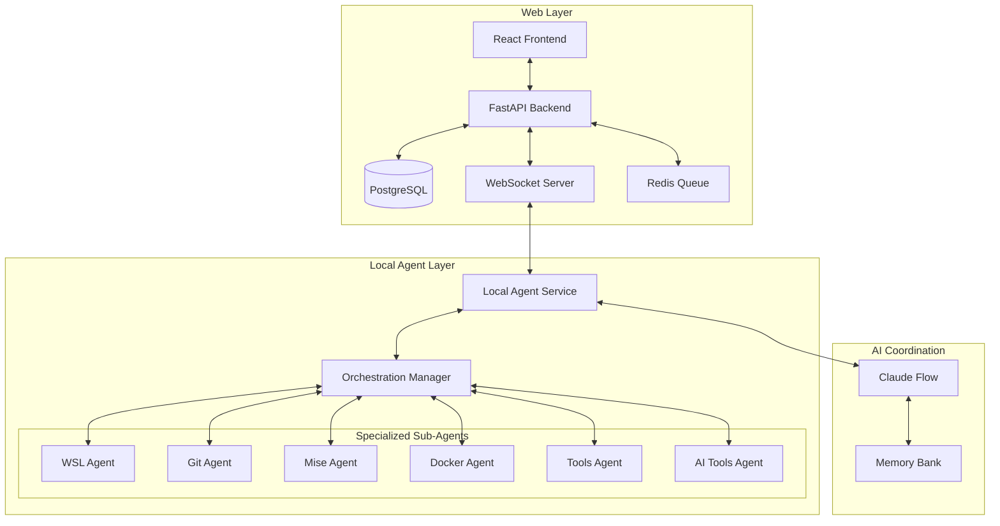
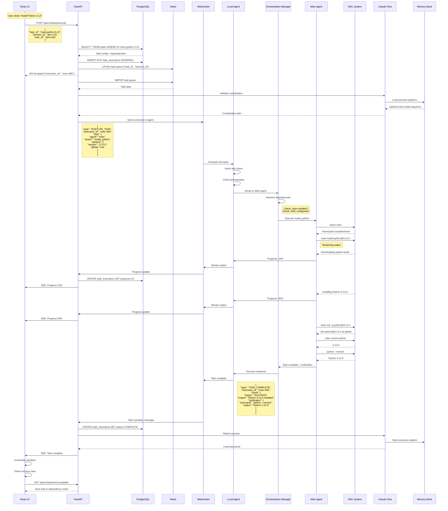
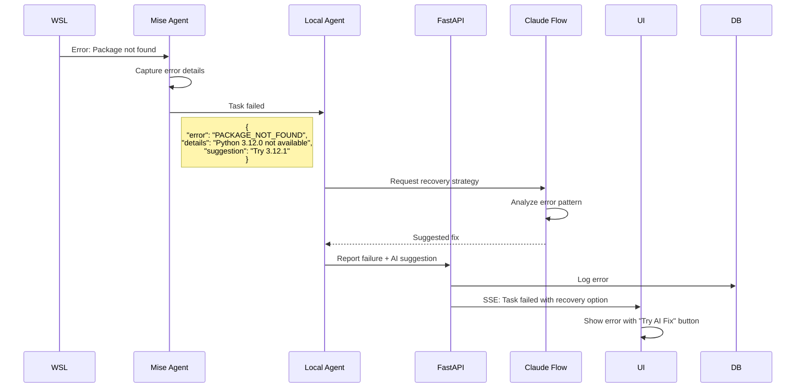

# bAIos - AI-Powered WSL Onboarding System Architecture v2

## System Architecture



## Core Components Detail

### Local Agent Sub-Systems

```yaml
LocalAgent:
  WSLAgent:
    - WSL2 installation and configuration
    - Ubuntu distro setup
    - systemd enablement
    - networking configuration
  
  MiseAgent:
    - mise installation
    - Node.js via mise
    - Python via mise
    - uv installation via mise
    - pipx installation via mise
    - Ruby, Go, Rust via mise
    - Global tool versions config
  
  GitAgent:
    - Git installation and config
    - GitHub CLI setup
    - SSH key generation
    - GPG key setup
    - Git credentials helper
  
  DockerAgent:
    - Docker Desktop installation
    - WSL2 backend configuration
    - Docker Compose setup
    - Credential helper config
  
  ToolsAgent:
    - VS Code installation
    - VS Code extensions
    - Terminal configuration (zsh, oh-my-zsh)
    - Development utilities (jq, ripgrep, fd, etc.)
  
  AIAgent:
    - Claude Desktop setup
    - Cursor IDE installation
    - GitHub Copilot configuration
    - AI tool authentication
```

## Complete Component-Level Message Trace

### Example Step: "Install Python 3.12 via Mise"

Here's the complete flow from UI click to completion verification:



## Detailed Message Formats

### 1. HTTP Request (UI → API)
```typescript
interface ExecuteTaskRequest {
  task_id: string;
  session_id: string;
  user_id: string;
  params?: Record<string, any>;
}

// POST /api/v1/tasks/execute
{
  "task_id": "mise-python-3.12",
  "session_id": "abc-123",
  "user_id": "john-doe",
  "params": {
    "version": "3.12.0",
    "set_global": true
  }
}
```

### 2. WebSocket Command (API → Agent)
```typescript
interface AgentCommand {
  type: 'EXECUTE_TASK' | 'CANCEL_TASK' | 'GET_STATUS';
  execution_id: string;
  task: {
    agent: 'mise' | 'git' | 'docker' | 'wsl' | 'tools' | 'ai';
    action: string;
    params: Record<string, any>;
  };
  metadata: {
    timeout: number;
    retry_policy: RetryPolicy;
    verification: VerificationStep[];
  };
}

// Example WebSocket message
{
  "type": "EXECUTE_TASK",
  "execution_id": "exec-456",
  "task": {
    "agent": "mise",
    "action": "install_python",
    "params": {
      "version": "3.12.0",
      "global": true
    }
  },
  "metadata": {
    "timeout": 300000,
    "retry_policy": {
      "max_attempts": 3,
      "backoff": "exponential"
    },
    "verification": [
      {
        "command": "mise current python",
        "expected": "3.12.0"
      },
      {
        "command": "python --version",
        "expected_pattern": "Python 3\\.12\\.\\d+"
      }
    ]
  }
}
```

### 3. Agent Internal Communication (Agent → Sub-Agent)
```python
@dataclass
class SubAgentTask:
    action: str
    params: Dict[str, Any]
    execution_context: ExecutionContext
    stream_callback: Callable[[str], None]

# Mise Agent receives
task = SubAgentTask(
    action="install_python",
    params={
        "version": "3.12.0",
        "global": True
    },
    execution_context=ExecutionContext(
        wsl_user="john",
        wsl_home="/home/john",
        env_vars={"PATH": "/home/john/.local/bin:..."}
    ),
    stream_callback=lambda output: agent.stream_output(output)
)
```

### 4. WSL Command Execution (Sub-Agent → System)
```python
class MiseAgent:
    def install_python(self, version: str, global_: bool) -> Result:
        # Check if mise is installed
        result = self.execute_wsl_command("which mise")
        if not result.success:
            return Result.failure("mise not found")
        
        # Install Python version
        install_cmd = f"mise install python@{version}"
        result = self.execute_wsl_command(
            install_cmd,
            stream=True,
            timeout=300
        )
        
        if result.success and global_:
            # Set as global version
            global_cmd = f"mise use -g python@{version}"
            self.execute_wsl_command(global_cmd)
        
        # Verify installation
        verify_cmd = "python --version"
        verify_result = self.execute_wsl_command(verify_cmd)
        
        return Result.success({
            "version": version,
            "verification": verify_result.output
        })
    
    def execute_wsl_command(self, cmd: str, stream: bool = False) -> CommandResult:
        # Constructs: wsl.exe -u john -d Ubuntu -- bash -c "cmd"
        wsl_cmd = f"wsl.exe -u {self.context.user} -d Ubuntu -- bash -c '{cmd}'"
        
        if stream:
            process = subprocess.Popen(
                wsl_cmd,
                stdout=subprocess.PIPE,
                stderr=subprocess.STDOUT,
                text=True,
                bufsize=1
            )
            
            for line in iter(process.stdout.readline, ''):
                self.stream_callback(line)
                
            return CommandResult(
                success=process.returncode == 0,
                output=None,
                exit_code=process.returncode
            )
        else:
            result = subprocess.run(wsl_cmd, capture_output=True, text=True)
            return CommandResult(
                success=result.returncode == 0,
                output=result.stdout,
                exit_code=result.returncode
            )
```

### 5. Progress Streaming (Agent → UI)
```typescript
// WebSocket message types for progress
interface ProgressMessage {
  type: 'PROGRESS';
  execution_id: string;
  progress: {
    percentage: number;
    message: string;
    output?: string;
  };
}

// Server-Sent Events to UI
interface SSEProgressEvent {
  event: 'progress';
  data: {
    execution_id: string;
    task_id: string;
    percentage: number;
    message: string;
    output_lines: string[];
  };
}
```

### 6. Verification & Completion
```typescript
interface TaskCompletion {
  type: 'TASK_COMPLETE';
  execution_id: string;
  result: {
    status: 'SUCCESS' | 'FAILURE' | 'PARTIAL';
    output: string;
    verification: {
      command: string;
      output: string;
      passed: boolean;
    }[];
    artifacts?: {
      installed_versions: string[];
      modified_files: string[];
      environment_changes: Record<string, string>;
    };
  };
  ai_insights?: {
    optimization_suggestions: string[];
    detected_issues: string[];
    performance_metrics: {
      duration_ms: number;
      retry_count: number;
    };
  };
}
```

## State Management

### Backend State (PostgreSQL)
```sql
-- Task execution tracking
UPDATE task_executions SET
  status = 'IN_PROGRESS',
  progress = 50,
  last_output = 'Installing Python-3.12.0...',
  updated_at = NOW()
WHERE id = 'exec-456';

-- On completion
UPDATE task_executions SET
  status = 'COMPLETE',
  progress = 100,
  completed_at = NOW(),
  verification_result = '{"python_version": "3.12.0"}',
  output_log = '<full output>'
WHERE id = 'exec-456';
```

### Agent State (Local)
```python
class AgentState:
    def __init__(self):
        self.active_executions: Dict[str, Execution] = {}
        self.wsl_connection: WSLConnection = None
        self.websocket: WebSocketConnection = None
        
    def track_execution(self, exec_id: str, task: Task):
        self.active_executions[exec_id] = Execution(
            id=exec_id,
            task=task,
            started_at=datetime.now(),
            status="IN_PROGRESS"
        )
```

## Error Handling Flow

If any step fails, here's the error propagation:



This architecture provides complete traceability from UI interaction through every system component, with AI coordination at critical decision points and comprehensive error handling.